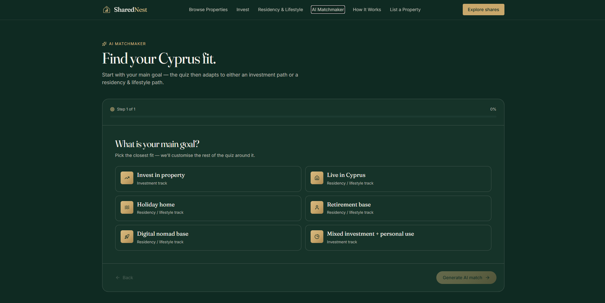
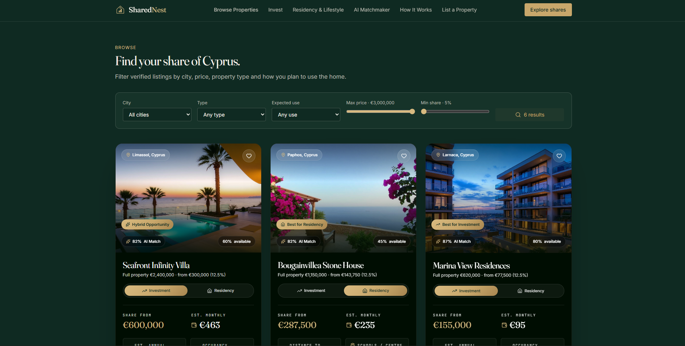

# SharedNest — Cyprus Property Co-Ownership Prototype

A responsive web application prototype for a fractional property co-ownership marketplace in Cyprus.

🔗 **Live Demo:** https://cyprus-share-dream.lovable.app/

## Screenshots

### Homepage


### Property Marketplace


### Co-Buyer Matchmaker


## About the Project
SharedNest explores a marketplace model in which multiple buyers can purchase shares of a holiday property together.

Owners receive usage rights based on their ownership share and, when the property is not being used by them, it can potentially be rented to generate proportional rental income.

The concept was developed as part of a team startup challenge during a **KPMG Cyprus summer programme in July 2026**.

I independently designed and built the web application prototype, using AI-assisted development with Lovable to rapidly translate the business concept into an interactive product experience.

## My Contribution

I was responsible for the website prototype, including:

- Translating the team's business concept into the product structure and user experience
- Designing and building the responsive interface using Lovable and AI-assisted development
- Creating the property discovery and property-detail experiences
- Building interactive investment and affordability calculators
- Developing the co-buyer matching questionnaire and compatibility interface
- Creating investment, residency and lifestyle-focused user journeys
- Building the property-listing and contact flows
- Iteratively refining the design, content and functionality during the programme

The wider startup concept and business model were developed collaboratively by the KPMG programme team; the website implementation was my individual contribution.

## Features

### Property Marketplace
Browse sample properties across Cyprus, including Limassol, Paphos, Larnaca, Nicosia and Ayia Napa, with information on:

- Property value
- Available ownership shares
- Estimated monthly costs
- Rental-income estimates
- Occupancy potential
- Lifestyle and investment indicators

### Property Details
Individual property pages provide a more detailed view of each opportunity and its ownership characteristics.

### Affordability Calculator
Interactive calculations allow users to explore different ownership-share and affordability scenarios.

### Co-Buyer Matchmaker
A questionnaire-based prototype demonstrates how potential co-buyers could be matched according to factors such as:

- Budget
- Desired ownership share
- Property usage preferences
- Lifestyle preferences
- Long-term ownership goals

> **Note:** The current matching system is a prototype using deterministic scoring logic and is not connected to a production AI model.

### Investment & Residency Experiences
Dedicated pages demonstrate how the platform could present properties from investment and lifestyle/residency perspectives.

### Buyer Dashboard
A prototype dashboard demonstrates how users could manage saved properties and potential co-ownership opportunities.

### Property Listing
A prototype workflow allows property owners to enter information about a property they would like to list.

### Responsive Design
The interface is designed for both desktop and mobile devices.

## Technology

The prototype uses a modern TypeScript/React stack:

- **React 19**
- **TypeScript**
- **TanStack Start**
- **TanStack Router**
- **TanStack Query**
- **Tailwind CSS**
- **Radix UI**
- **Recharts**
- **Vite**
- **Lovable** for AI-assisted rapid development

## Running the Project Locally

### Requirements

- Node.js
- npm

### Installation

```bash
git clone https://github.com/antoniskotopoulis08-jpg/sharednest-cyprus.git
cd cyprus-share-dream
npm install
npm run dev
